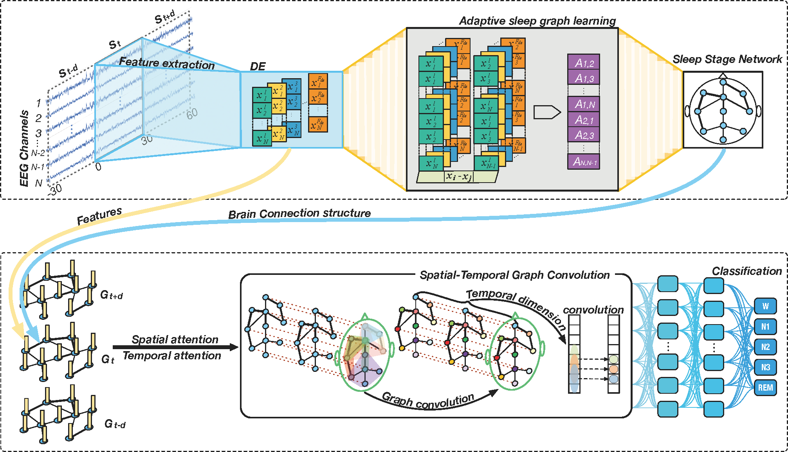

# GraphSleepNet

GraphSleepNet: Adaptive Spatial-Temporal Graph Convolutional Networks for Sleep Stage Classification



These are source code and experimental setup for the MASS SS3 database.

# References

GraphSleepNet: Adaptive Spatial-Temporal Graph Convolutional Networks for Sleep Stage Classification. (IJCAI 2020)

```latex
@inproceedings{ijcai2020-184,
  title     = {GraphSleepNet: Adaptive Spatial-Temporal Graph Convolutional Networks for Sleep Stage Classification},
  author    = {Jia, Ziyu and Lin, Youfang and Wang, Jing and Zhou, Ronghao and Ning, Xiaojun and He, Yuanlai and Zhao, Yaoshuai},
  booktitle = {Proceedings of the Twenty-Ninth International Joint Conference on
               Artificial Intelligence, {IJCAI-20}},
  publisher = {International Joint Conferences on Artificial Intelligence Organization},             
  pages     = {1324--1330},
  year      = {2020},
  month     = {7},
  doi       = {10.24963/ijcai.2020/184},
  url       = {https://doi.org/10.24963/ijcai.2020/184},
}
```

# Datasets

 We evaluate our model on the Montreal Archive of Sleep Studies (MASS)-SS3 dataset. The Montreal Archive of Sleep Studies (MASS) is an open-access and collaborative database of laboratory-based polysomnography (PSG) recordings. Information on how to obtain it can be found [here](http://massdb.herokuapp.com/en/).

# Requirements

- Python 3.6
- Tensorflow 1.12.0
- Keras 2.2.4
- numpy 1.15.4
- scipy 1.1.0
- scikit-learn 0.21.3

# Usage

- Data preparation

  Extract DE features and make data package.

  For more details, please refer to [preprocess](preprocess).

- Configuration

  Write the config file in the format of the example.
    
    - We provide a sample config file in `/config/SS3.config`

- Network training and testing

  Run `python train.py` with -c and -g parameters.
  
  + -c: The configuration file.
  + -g: The number of the GPU to use. E.g., `0`, `1,3`. Set this to `-1` if only CPU is used. 

  ```shell
  python train.py -c SS3.config -g -1
  ```

